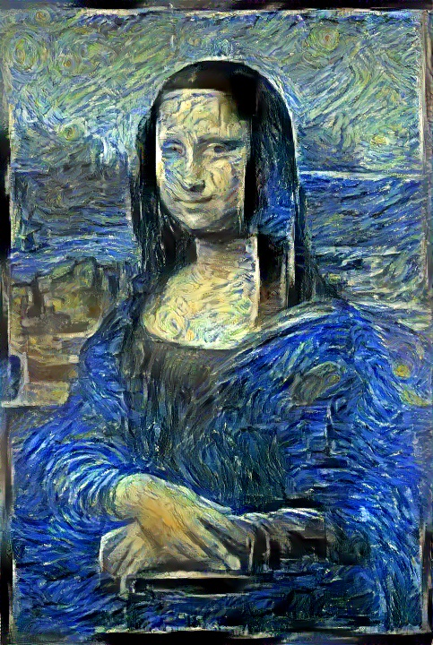
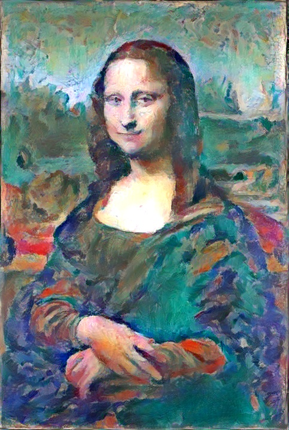
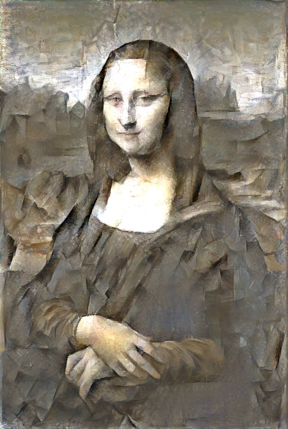

# Neural Style Transfer Images
### Mona Lisa in style of "Starry Night"

### Mona Lisa in the style of "Woman with a Hat" 

### Mona Lisa in the style of "Girl with a Mandolin"

[Code](https://github.com/PJ-Finlay/pytorch-neural-style-transfer)

All images licensed Creative Commons CC0 (Public Domain)

